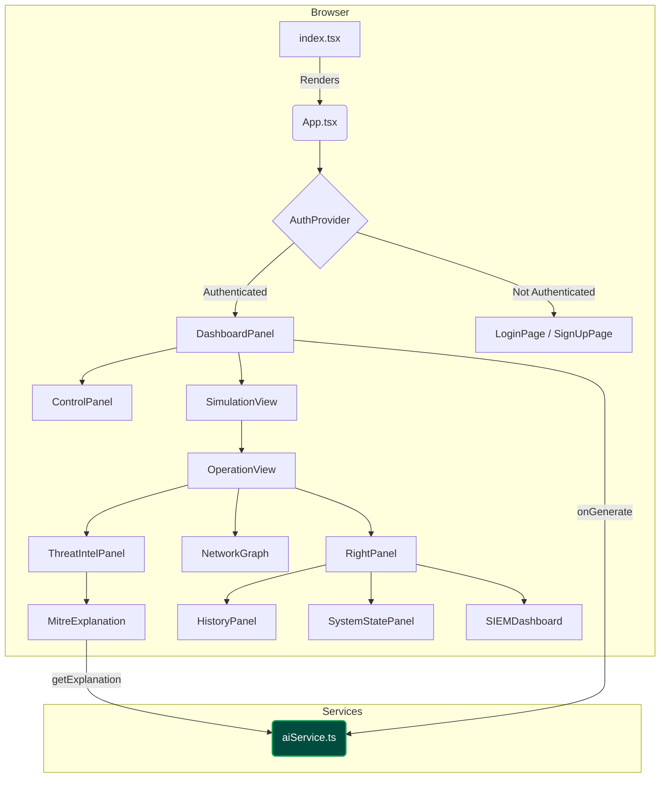

# ADversary: Technical Documentation

## 1. Introduction & Architectural Philosophy

ADversary is a single-page application (SPA) built with React and TypeScript. Its architecture is designed to be client-centric, leveraging the power of the browser to manage state and render a dynamic user interface, while offloading the complex task of scenario generation to the Google Gemini API.

The core philosophy is **stateful realism**. The application is architected around a single, comprehensive `SimulationScenario` object. Once this object is generated by the AI, the entire UI becomes a deterministic reflection of its contents. This ensures data consistency and allows for features like automated progression, interactive history review, and full scenario import/export.

---

## 2. Architecture Overview

The application follows a standard component-based architecture. A central `DashboardPanel` manages the top-level state, orchestrating user input via the `ControlPanel` and displaying results in the `SimulationView`. All interactions with the AI are funneled through a dedicated `aiService` module, which encapsulates the prompt engineering and API communication logic.

### Mermaid Architecture Diagram

**Figure 1: Application Component Architecture.** This diagram illustrates the hierarchical relationship between the main React components. The `DashboardPanel` acts as the primary orchestrator, managing state and user interactions, while the `aiService` provides the core AI-driven data generation.

---

## 3. Component Breakdown

This section details the purpose and functionality of each major component in the application.

### `App.tsx`
- **Role:** The root component of the authenticated application.
- **Functionality:** Manages the authentication state provided by `AuthContext`. It acts as a router, displaying either the `LoginPage`/`SignUpPage` or the main `DashboardPanel` based on user authentication. It also manages the visibility of the `SettingsModal`.

### `DashboardPanel.tsx`
- **Role:** The primary stateful component and orchestrator for the main application view.
- **Functionality:**
    -   Manages the core application state: `scenario`, `isLoading`, `error`, and all user inputs from the `ControlPanel` (`environment`, `attackType`, `attackDirectives`).
    -   Contains the `handleGenerate` function, which calls the `aiService` to fetch a new simulation.
    -   Handles the logic for the **Import/Export** feature by reading/writing the `ExportedScenario` object.
    -   Lifts state from `ControlPanel` to enable scenario loading to correctly populate the UI.

### `ControlPanel.tsx`
- **Role:** The user's primary interface for configuring and initiating a simulation.
- **Functionality:**
    -   Renders the structured YAML-like editor for the environment configuration.
    -   Provides the dropdown for selecting a primary attack vector and a textarea for optional attack directives.
    -   Manages the "Start Simulation," "Import," and "Export" buttons, triggering the corresponding handlers passed down from `DashboardPanel`.
    -   Displays a loading state when a simulation is being generated.

### `SimulationView.tsx`
- **Role:** A conditional renderer that displays the current state of the simulation area.
- **Functionality:**
    -   Shows a loading message while the AI is generating data.
    -   Displays a placeholder message if no scenario is active.
    -   Renders the `OperationView` component once a `scenario` object is available.

### `OperationView.tsx`
- **Role:** The central command console for an active simulation.
- **Functionality:**
    -   Manages the state of the simulation's progression: `activeStepIndex`, `revealedSteps`, and `isPlaying`.
    -   Implements the **automated simulation flow** using `useEffect` and `setTimeout` to advance steps.
    -   Provides "Pause" and "Resume" controls.
    -   Lays out the main two-column interface, orchestrating the `ThreatIntelPanel`, `NetworkGraph`, and `RightPanel`.
    -   Derives and passes down crucial state like `compromisedHostIds` and `attackPath` to child components based on the `activeStepIndex`.

### `NetworkGraph.tsx`
- **Role:** A dynamic, data-driven visualization of the simulation's network.
- **Functionality:**
    -   Receives the `network_topology`, `targetHostId`, `compromisedHostIds`, and `attackPath` as props.
    -   Calculates node positions in a circular layout to prevent overflow and ensure a clean presentation.
    -   Renders nodes and edges using SVG and styled `div` elements.
    -   Applies conditional styling to visually distinguish target hosts, compromised hosts, and the attack path.

### `SystemStatePanel.tsx`
- **Role:** An at-a-glance dashboard for the network's overall security status.
- **Functionality:**
    -   Receives the `topology`, `compromisedHostIds`, and `securityPosture`.
    -   Dynamically calculates and displays statistics (e.g., compromised hosts/DCs) based on the props. It contains no static data.
    -   Applies color-coding based on the AI-provided security posture (`Critical`, `Guarded`, etc.).

### `SIEMDashboard.tsx`
- **Role:** A professional, interactive interface for analyzing security events.
- **Functionality:**
    -   Receives the cumulative list of `system_alerts` for the current and all previous steps.
    -   Manages local state for `filter` (by severity) and `searchQuery`.
    -   Uses `useMemo` to efficiently calculate severity counts and the list of filtered alerts.
    -   Provides a robust UI for filtering and searching, mimicking the functionality of real SIEM tools.

---

## 4. AI Service & Prompt Engineering (`aiService.ts`)

The `aiService.ts` module is the brain of the application. It is solely responsible for communicating with the Google Gemini API and ensuring the returned data is valid and structured.

### Data Structures
The service defines a comprehensive set of TypeScript interfaces (`SimulationScenario`, `AttackStep`, `NetworkTopology`, etc.) that represent the entire world of the simulation. These interfaces are used to generate a strict JSON schema for the AI.

### Prompt Engineering for Realism
The core of ADversary's realism comes from its prompt engineering strategy. The prompt sent to Gemini is carefully constructed to enforce several key constraints:

1.  **Role Assignment:** The AI is told it is generating a scenario for a professional cybersecurity tool named "ADversary."
2.  **Source of Truth Declaration:** The prompt explicitly states that the user-provided YAML configuration is the **"absolute and only source of truth."** This is the most critical directive.
3.  **Strict Grounding:** The AI is forbidden from hallucinating assets and is instructed to build the network topology and attack chain *exclusively* from the user's input.
4.  **Structured Input:** The prompt informs the AI that it will receive a structured input and must parse it accordingly.
5.  **Attack Hierarchy:** The prompt defines a clear hierarchy, stating that the `attackType` is the primary goal and the optional `attackDirectives` are high-priority modifiers.
6.  **Schema Enforcement:** The AI is instructed to return a single, valid JSON object that strictly adheres to the provided `responseSchema`. This is a feature of the Gemini API that ensures the output is machine-readable and eliminates the need for fragile string parsing on the frontend.

### `getMitreExplanation`
This secondary function provides on-demand context for the UI. It sends a separate, targeted prompt to the AI to generate a concise, professional summary for a given MITRE ATT&CK® TTP.

---

## 5. Data Flow

The primary data flow of the application is unidirectional, ensuring a predictable and maintainable state management pattern.

1.  **Configuration:** The user populates the `ControlPanel` with the environment configuration, attack vector, and optional directives. This state is managed by the `DashboardPanel`.
2.  **Generation:** The user clicks "Start Simulation." The `onGenerate` handler in `DashboardPanel` calls `generateSimulationScenario` from the `aiService`, passing the user's inputs.
3.  **API Request:** `aiService` constructs the detailed prompt and sends it to the Gemini API, requesting a JSON response that matches the predefined schema.
4.  **State Update:** The `aiService` returns the validated `SimulationScenario` object. The `DashboardPanel` updates its `scenario` state with this object.
5.  **Rendering:** React's rendering engine detects the state change. The `SimulationView` and its children (starting with `OperationView`) re-render, displaying the UI based on the new `scenario` data.
6.  **Simulation Progression:** `OperationView`'s internal timer updates its `activeStepIndex`. This change propagates down as props to `ThreatIntelPanel`, `NetworkGraph`, and `RightPanel`, causing them to re-render and display the data relevant to the new step.

This clean, top-down data flow ensures that the UI is always a direct and accurate representation of the current simulation state.
