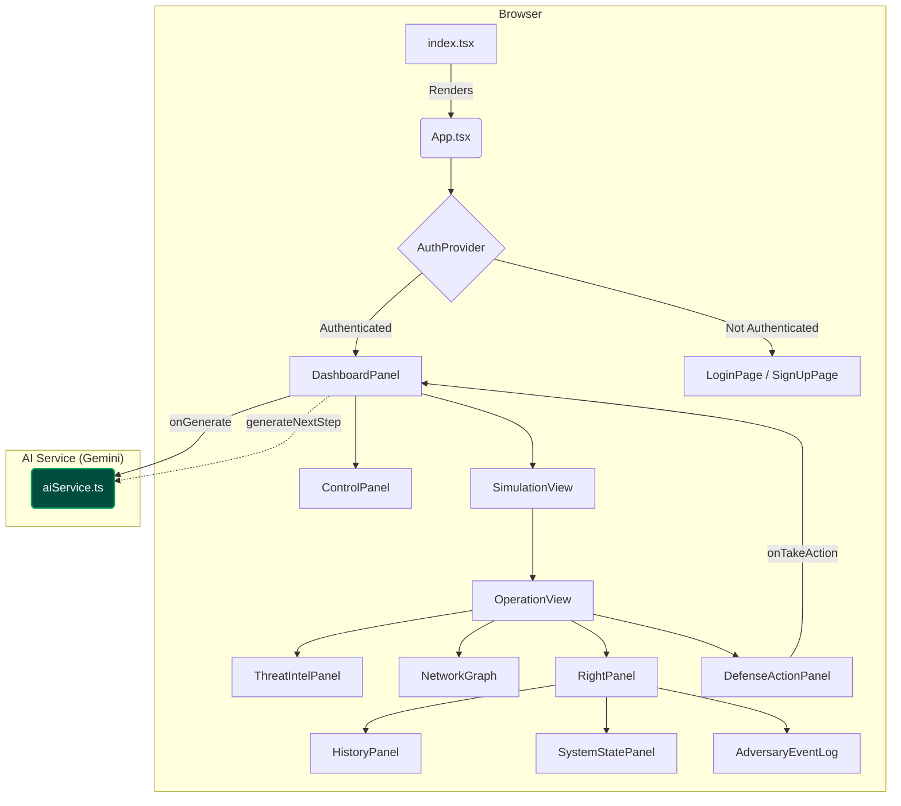

# ADversary: Technical Documentation

## 1. Introduction & Architectural Philosophy

ADversary is a single-page application (SPA) built with React and TypeScript. Its architecture has evolved from a static scenario generator into a **dynamic, interactive, agent-based system**. The application leverages the browser to manage state and render a dynamic UI, while using the **Google Gemini** LLM as a **reactive AI agent** that serves as the Red Team opponent.

The core philosophy is **interactive, stateful realism**. The application is architected around a live `ActiveSimulation` object that grows and changes with each turn. The user's defensive actions are fed back to the AI, which then generates the next logical step in the attack chain. This creates a stateful, unpredictable, and highly realistic training experience.

---

## 2. Architecture Overview

The application follows a component-based architecture. A central `DashboardPanel` manages the top-level state, orchestrating user input from the `ControlPanel` and displaying the evolving simulation in the `SimulationView`. All interactions with the AI are funneled through the `aiService`, which now manages a conversational, turn-based interaction with the Gemini API.

### Application Architecture Diagram

**Figure 1: Application Component Architecture and Interactive Data Flow.**

This diagram illustrates the application's architecture, highlighting the new interactive loop.

-   **Initial Generation:** The user configures a scenario in the `ControlPanel`. Clicking "Start Simulation" triggers the `DashboardPanel` to call the `startInitialSimulation` function in `aiService.ts`. The service returns the first step of the attack, and the UI is rendered.

-   **User Interaction:** The `OperationView` displays the current attack step and renders the `DefenseActionPanel`, which presents the user with a set of defensive choices.

-   **Interactive Loop:**
    1.  The user selects an action in the `DefenseActionPanel`.
    2.  This triggers the `onTakeAction` callback, which is handled by the `DashboardPanel`.
    3.  The `DashboardPanel` calls the `generateNextAttackStep` function in `aiService.ts`, passing the full attack history and the user's chosen action.
    4.  The `aiService` sends this context to the Gemini model, which generates a *new*, reactive attack step.
    5.  The `DashboardPanel` receives the new step, appends it to its `ActiveSimulation` state object, and triggers a re-render of the application.
    6.  The `OperationView` now displays the new latest step, and the loop repeats.

This architecture transforms the application from a simple generator into a stateful, interactive system.

---

## 3. Component Breakdown

This section details the purpose and functionality of each major component in the application.

### `DashboardPanel.tsx`
- **Role:** The primary stateful component and orchestrator for the main application view.
- **Functionality:**
    -   Manages the core application state, including the evolving `ActiveSimulation` object.
    -   Contains the `handleGenerate` and `handleTakeAction` functions, which manage the lifecycle of the interactive simulation by calling the `aiService`.

### `ControlPanel.tsx`
- **Role:** The user's primary interface for configuring and initiating a simulation.
- **Functionality:**
    -   Renders the structured YAML editor for the environment configuration.
    -   Provides the dropdown for selecting a primary attack vector and a textarea for optional attack directives.

### `OperationView.tsx`
- **Role:** The central command console for the active simulation.
- **Functionality:**
    -   Manages the view of the attack history, automatically focusing on the latest step generated by the AI.
    -   Conditionally renders the `DefenseActionPanel` only when the user is viewing the latest step, prompting them to take their turn.
    -   No longer contains auto-play logic; progression is now user-driven.

### `DefenseActionPanel.tsx`
-   **Role:** The primary UI for user interaction in the turn-based system.
-   **Functionality:**
    -   Displays the list of defensive choices generated by the AI for the current step.
    -   Handles user clicks and triggers the `onTakeAction` callback to advance the simulation.

---

## 4. AI Service & Prompt Engineering (`aiService.ts`)

The `aiService.ts` module is the brain of the application. It has been significantly refactored to support the agent-based model.

### Architecture
The service now orchestrates a conversation with the Gemini API. It has two primary functions:
-   `startInitialSimulation`: Generates the setup for the scenario and only the *first* attack step.
-   `generateNextAttackStep`: Takes the entire attack history and the user's last defensive action as context to generate the *next* reactive attack step.

### Prompt Engineering for Interaction
The service now uses two distinct system prompts to manage the conversation:
1.  **Initial Prompt:** Instructs the AI to set up the scenario and generate the first step, along with the first set of defensive choices for the user.
2.  **Next Step Prompt:** This is the core of the reactive logic. It instructs the AI to analyze the attack history and, most importantly, the **"Blue Team's Last Action."** It explicitly tells the AI it must react logically to what the defender did.

This two-prompt system, combined with sending the full conversation history, allows the Gemini model to function as a stateful, reactive opponent. The mandatory `defensive_choices` field in the response schema ensures that the interactive loop can always continue.

---

## 5. Data Flow

The application's data flow has evolved into an interactive loop.

1.  **Configuration:** The user populates the `ControlPanel`.
2.  **Initiation:** The user clicks "Start Simulation." `DashboardPanel` calls `startInitialSimulation`.
3.  **First Step:** The `aiService` returns the initial state, which is set in `DashboardPanel`. The UI renders the first step and the `DefenseActionPanel`.
4.  **User Action:** The user selects a defensive move in the `DefenseActionPanel`.
5.  **Reactive Generation:** The `handleTakeAction` function in `DashboardPanel` calls `generateNextAttackStep`, passing the history and the user's action.
6.  **State Update:** The `aiService` returns a single new `AttackStep`. `DashboardPanel` appends this to its `steps` array in the `ActiveSimulation` state.
7.  **Re-render:** React re-renders the UI to show the new latest step. The `DefenseActionPanel` now shows new choices.
8.  The flow returns to Step 4, continuing until the scenario concludes.