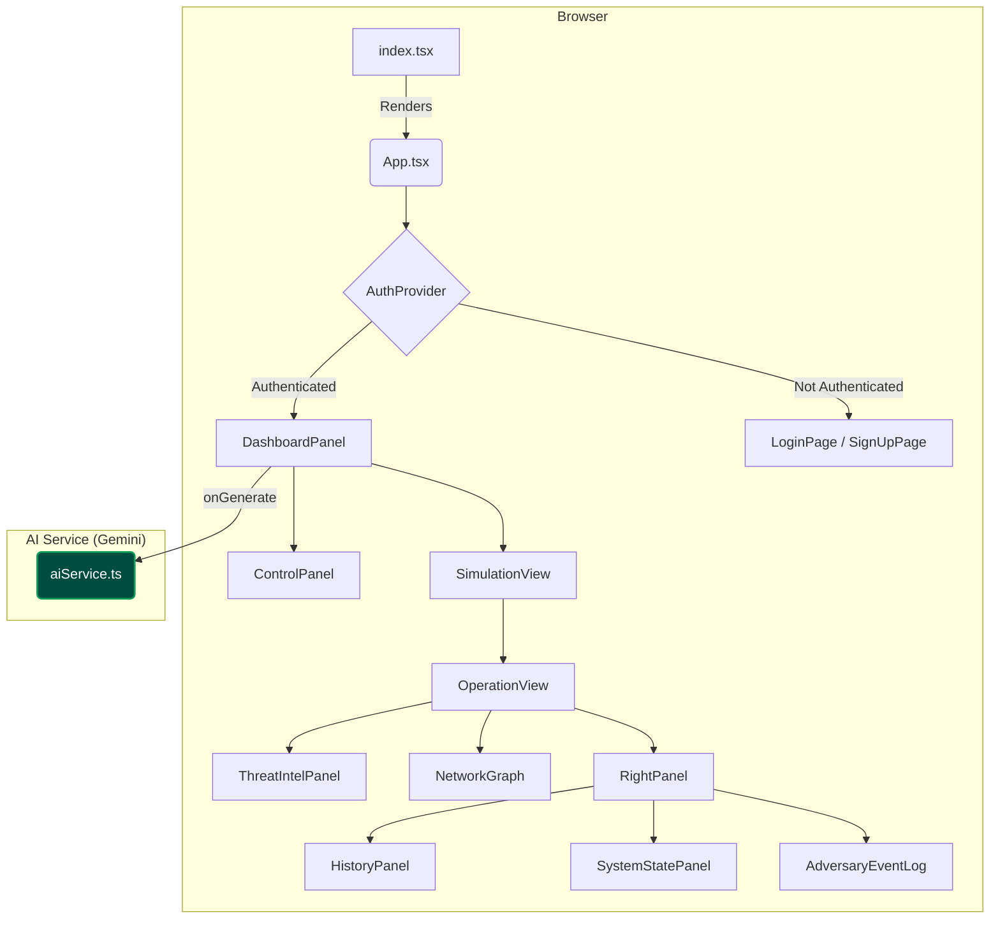

# ADversary: Technical Documentation

## 1. Introduction & Architectural Philosophy

ADversary is a single-page application (SPA) built with React and TypeScript. Its architecture is designed to be client-centric, leveraging the power of the browser to manage state and render a dynamic user interface, while offloading the complex task of scenario generation to the **Google Gemini** Large Language Model (LLM).

The core philosophy is **stateful realism**. The application is architected around a single, comprehensive `SimulationScenario` object. Once this object is generated by the AI, the entire UI becomes a deterministic reflection of its contents. This ensures data consistency and allows for features like automated progression, interactive history review, and full scenario import/export.

---

## 2. Architecture Overview

The application follows a standard component-based architecture. A central `DashboardPanel` manages the top-level state, orchestrating user input via the `ControlPanel` and displaying results in the `SimulationView`. All interactions with the AI are funneled through a dedicated `aiService` module, which encapsulates the prompt engineering and API communication with the Gemini API.

### Application Architecture Diagram

**Figure 1: Application Component Architecture and Data Flow.**

This diagram provides a high-level overview of the ADversary application's frontend architecture and its interaction with the Gemini AI service layer. It illustrates the hierarchical relationship between React components and the primary unidirectional data flow.

-   **Authentication Layer:** The application entry point (`index.tsx`) renders the `App` component, which is wrapped by an `AuthProvider`. This context acts as a gatekeeper, rendering the `LoginPage` or `SignUpPage` if the user is not authenticated. Once a successful login occurs, it renders the main `DashboardPanel`.

-   **Core Orchestrator (`DashboardPanel`):** This is the central hub of the authenticated application. It manages the primary state, including all user inputs from the `ControlPanel` (environment configuration, attack directives) and the main `SimulationScenario` object returned from the AI.

-   **User Input and AI Interaction:** The user configures a scenario in the `ControlPanel`. When the "Start Simulation" button is clicked, the `DashboardPanel` initiates a call to the `aiService.ts` module. This service is the sole component responsible for all communication with the Gemini API, encapsulating the complex prompt engineering and data validation logic.

-   **Data Display and Simulation:** Once the `aiService` returns a valid `SimulationScenario` object, the `DashboardPanel` updates its state. This triggers a re-render of the `SimulationView` and its primary child, `OperationView`. The `OperationView` then orchestrates the entire active simulation, managing the step progression and passing down relevant slices of the scenario data to its specialized child components.

This architecture ensures a clear separation of concerns and a predictable, top-down data flow, making the application robust and maintainable.

---

## 3. Component Breakdown

This section details the purpose and functionality of each major component in the application.

### `DashboardPanel.tsx`
- **Role:** The primary stateful component and orchestrator for the main application view.
- **Functionality:**
    -   Manages the core application state: `scenario`, `isLoading`, `error`, and all user inputs from the `ControlPanel`.
    -   Contains the `handleGenerate` function, which calls the `aiService` to fetch a new simulation.
    -   Handles the logic for the **Import/Export** feature.

### `ControlPanel.tsx`
- **Role:** The user's primary interface for configuring and initiating a simulation.
- **Functionality:**
    -   Renders the structured YAML editor for the environment configuration.
    -   Provides the dropdown for selecting a primary attack vector and a textarea for optional attack directives.

### `OperationView.tsx`
- **Role:** The central command console for an active simulation.
- **Functionality:**
    -   Manages the state of the simulation's progression: `activeStepIndex`, `revealedSteps`, and `isPlaying`.
    -   Implements the **automated simulation flow** using `useEffect` and `setTimeout`.
    -   Orchestrates the main two-column UI layout.

### `ThreatIntelPanel.tsx`
- **Role:** A tabbed interface providing detailed context for the current attack step.
- **Functionality:**
    -   Displays attacker commands, MITRE ATT&CK mappings, and defense recommendations.
    -   **Dynamically renders a "PowerShell Events" tab** that uses the `PowerShellLogViewer` component to display detailed forensic logs (Event ID 4104) when they are available for the current step.

### `NetworkGraph.tsx`
- **Role:** A dynamic, data-driven visualization of the simulation's network.
- **Functionality:**
    -   Calculates node positions using a deterministic, circular layout algorithm for clarity.
    -   Renders nodes and edges, applying conditional styling to visually distinguish target hosts, compromised hosts, and the attack path.

### `AdversaryEventLog (SIEMDashboard.tsx)`
- **Role:** A professional, interactive interface for analyzing security events generated by the adversary.
- **Functionality:**
    -   Receives the cumulative list of `system_alerts`.
    -   Enhances realism by adding simulated timestamps and parsing source hostnames from alert text.

---

## 4. AI Service & Prompt Engineering (`aiService.ts`)

The `aiService.ts` module is the brain of the application. It is solely responsible for communicating with the Google Gemini API and ensuring the returned data is valid and structured.

### Architecture
The service is architected as a pure Gemini client. It uses the official `@google/genai` SDK and relies on an API key provided via the `process.env.API_KEY` environment variable. This approach simplifies the codebase and aligns with security best practices by not handling keys in the browser.

### Prompt Engineering for Realism
The core of ADversary's realism comes from its prompt engineering strategy. The system prompt sent to Gemini is carefully constructed to enforce several key constraints:

1.  **Role Assignment:** The AI is told it is an expert red team operator generating a scenario for a professional cybersecurity tool named "ADversary."
2.  **Source of Truth Declaration:** The prompt explicitly states that the user-provided YAML configuration is the **"absolute and only source of truth."** This is the most critical directive to prevent hallucination.
3.  **Schema Enforcement:** The AI is instructed to return a single, valid JSON object that strictly adheres to a provided schema. This is achieved using the powerful `responseSchema` feature of the Gemini API, which guarantees the structure of the output.
4.  **Generate Forensic Artifacts:** The prompt explicitly instructs the AI to generate realistic forensic artifacts. A key example is the requirement to produce a detailed PowerShell Script Block log (Event ID 4104) for every single PowerShell command executed in the simulation. This is reflected in the data schema with the addition of the `PowerShellLog` interface.

---

## 5. Data Flow

The primary data flow of the application is unidirectional, ensuring a predictable and maintainable state management pattern.

1.  **Configuration:** The user populates the `ControlPanel`. The API key is sourced from the environment.
2.  **Generation:** The user clicks "Start Simulation." The `onGenerate` handler in `DashboardPanel` calls `generateSimulationScenario` from the `aiService`.
3.  **API Request:** `aiService` constructs the prompt and schema and sends the request to the Gemini API.
4.  **State Update:** The `aiService` returns the validated `SimulationScenario` object. The `DashboardPanel` updates its `scenario` state.
5.  **Rendering:** React detects the state change and re-renders the `SimulationView` and its children with the new data.
6.  **Simulation Progression:** `OperationView`'s internal timer updates its `activeStepIndex`, causing child components to re-render with data relevant to the new step.

This clean, top-down data flow ensures that the UI is always a direct and accurate representation of the current simulation state.